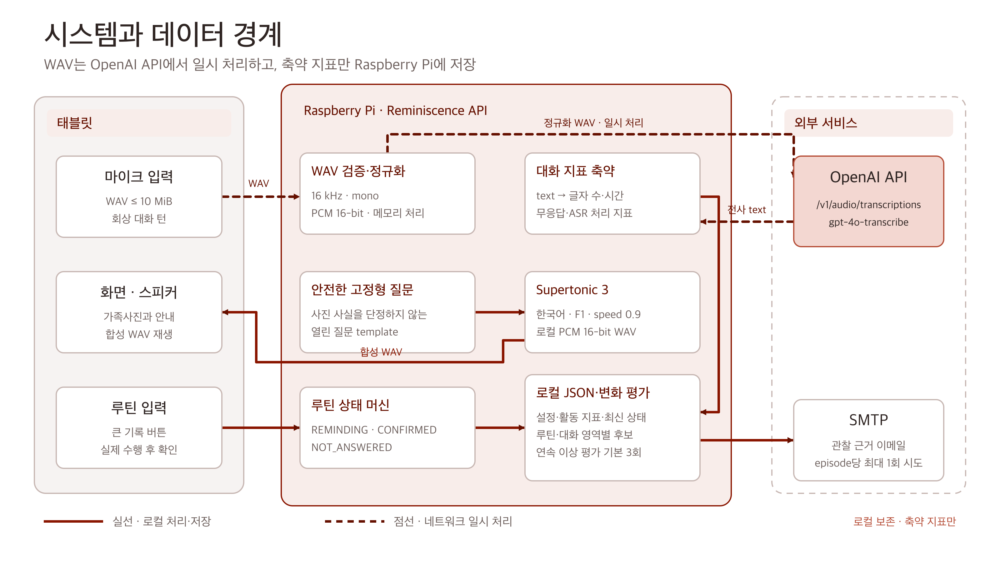
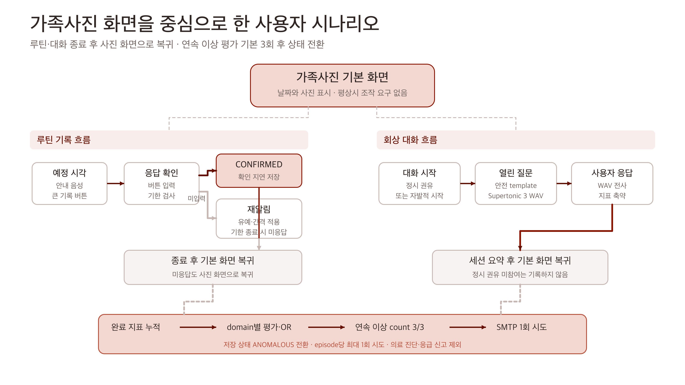
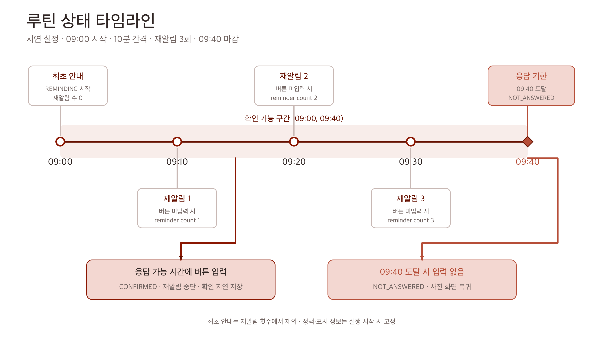
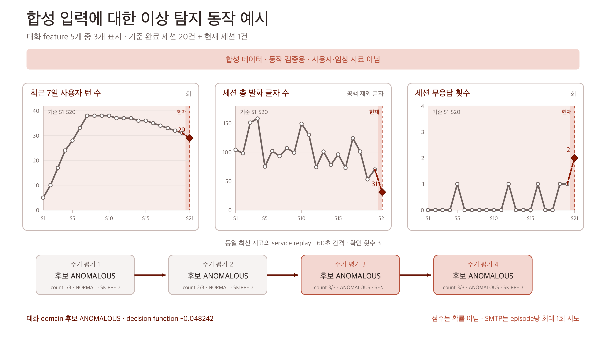

# Reminiscence

가족사진 기반 회상 대화와 개인별 생활 패턴 변화 알림을 위한 스마트 케어 액자

Reminiscence: A Smart Care Frame for Photo-Elicited Conversation and Personalized Routine Change Monitoring

KW-Reminiscence

# A0 메인 포스터 원고

## 한 줄 소개

Reminiscence는 평상시에는 가족사진을 보여 주고, 정해진 시각에는 식사·복약 루틴과 선택형 회상 대화를 안내하며, 누적된 최소 행동 지표의 영역별 평가가 연속으로 이상 후보를 반환하면 상태를 전환하고 보호자에게 관찰 근거를 전달하는 Raspberry Pi 기반 시스템이다.

## 연구 배경

사진과 같은 친숙한 단서를 활용한 회상 활동은 과거 경험을 이야기하도록 돕는 접근으로 사용되어 왔다. Cochrane 체계적 문헌고찰은 일부 환경에서 삶의 질, 인지, 의사소통과 기분에 작은 이점이 나타날 수 있다고 보고했으나 효과의 크기와 방향은 중재 방식과 환경에 따라 달랐다. 디지털 회상 활동에 관한 예비 연구도 가능성을 제시했지만, 제한된 표본과 연구 설계 때문에 임상 효과를 일반화하기 어렵다. 본 프로젝트는 치료 효과 검증을 연구 범위에서 제외하고, 일상 공간에서 부담이 낮은 상호작용과 관찰 가능한 생활 변화 기록을 구현 범위로 정했다.

고령 사용자를 위한 디지털 인터페이스에는 일관된 화면 구조, 이해하기 쉬운 문구, 충분한 대비와 조작 부담을 줄인 입력 방식이 필요하다. Reminiscence는 태블릿을 가족사진 액자로 유지하고, 루틴 완료 입력을 큰 버튼 하나로 제한하며, 안내가 끝나면 다시 사진 화면으로 돌아가도록 설계했다.

## 문제 정의

### 상호작용 부담

식사와 복약을 기록하는 과정이 복잡하면 일상 사용이 중단될 수 있다. 음성 인식 결과를 루틴 완료 근거로 사용하면 주변 소음과 인식 오류가 수행 기록에 직접 영향을 준다. 시스템은 실제 수행 후 누르는 큰 기록 버튼을 루틴의 유일한 완료 입력으로 사용하고, 음성은 선택형 회상 대화에서만 수집한다.

### 한 번의 미응답이 갖는 낮은 정보성

개별 미응답이나 짧은 대화는 일정 변경, 기기 미사용, 피로와 같은 여러 원인으로 발생할 수 있다. 한 사건을 즉시 경고로 바꾸면 보호자가 반복 알림에 노출될 수 있다. 시스템은 동일 사용자의 루틴과 대화 이력을 별도 영역으로 평가하고, 두 영역의 OR 결과가 기본 세 번의 연속 주기 평가에서 이상이면 저장 상태를 ANOMALOUS로 전환한다.

### 음성 데이터의 민감성

가족사진을 보며 나누는 대화에는 개인적 기억과 관계 정보가 포함될 수 있다. 태블릿에서 수집한 WAV는 전사를 위해 외부 네트워크 경계를 통과하지만, Reminiscence의 로컬 저장소에는 WAV와 전사문을 남기지 않는다. 전사 결과는 공백을 제외한 글자 수, 입력 시간, 초당 글자 수, 무응답 여부와 처리 지표로 축약한 뒤 로컬 JSON에 저장한다.

## 연구 질문과 목표

연구 질문은 가족사진 액자의 익숙한 사용 맥락 안에서 루틴 기록, 선택형 회상 대화, 최소 지표 기반 개인 변화 관찰과 설명 가능한 보호자 알림을 하나의 흐름으로 통합할 수 있는가이다. 구현 목표는 태블릿과 Raspberry Pi가 역할을 분담하는 작동 가능한 프로토타입을 구축하고, 원본 대화의 로컬 비보존, 결정적인 상태 전이, 개인 이력 기반 이상 평가와 알림 중복 억제를 소프트웨어 수준에서 검증하는 것이다.

## 시스템 설계

태블릿 클라이언트는 날짜와 가족사진을 표시하고, 큰 기록 버튼, 마이크와 스피커를 제공한다. Raspberry Pi의 FastAPI 애플리케이션은 루틴 상태 전이, 고정형 회상 질문, 음성 전사 연동, 지표 축약, Supertonic 3 음성 합성, 로컬 JSON 저장, 이상 평가와 보호자 이메일 조정을 담당한다.

회상 대화의 WAV는 Raspberry Pi 메모리에서 16 kHz mono PCM 16-bit로 정규화된다. 정규화한 음성은 OpenAI API의 POST /v1/audio/transcriptions로 전송되며 모델 식별자는 gpt-4o-transcribe이다. 반환된 text는 대화 지표로 축약되고 로컬 파일에 보존되지 않는다. OpenAI API의 서버 측 데이터 처리는 운영 시 별도로 확인한다.

안내 문구와 회상 질문의 spoken text는 Raspberry Pi에서 실행되는 Supertonic 3 ONNX 모델로 합성한다. 현재 기본 설정은 한국어, F1 음색, 0.9배속, 8 inference steps이며 결과는 PCM 16-bit WAV로 반환한다. 합성 WAV는 Cache-Control: no-store로 전달하고 TTS 계층에서 파일이나 장기 캐시로 보존하지 않는다. 회상 질문은 사진 속 인물이나 사건을 사실로 단정하지 않는 고정형 안전 문구를 사용한다.

Figure 1. 태블릿, Raspberry Pi, OpenAI API와 SMTP의 데이터 경계. WAV와 전사 text는 일시 처리되고 축약 지표만 로컬 JSON에 저장된다.

## 사용자 시나리오

평상시 태블릿은 날짜와 가족사진을 보여 준다. 예정 시각이 되면 화면에 루틴 이름과 큰 기록 버튼을 표시하고 Raspberry Pi가 합성한 안내 음성을 재생한다. 사용자가 응답 가능 시간 안에 버튼을 누르면 해당 수행 건은 CONFIRMED로 종료된다. 입력이 없으면 설정된 유예시간과 재알림 간격에 따라 안내를 반복하고, 응답 기한이 끝나면 NOT_ANSWERED로 마감한 뒤 사진 화면으로 복귀한다.

회상 대화는 설정된 시각의 권유 또는 사용자의 자발적 시작으로 진행된다. 태블릿은 사진과 열린 질문을 제시하고, 사용자 음성을 WAV로 전송한다. 서버는 전사 결과를 지표로 축약하고 다음 안전 질문을 반환한다. 정시 권유를 지나쳤다는 사실은 저장하거나 이상으로 판정하지 않으며, 같은 날 늦게 시작한 자발적 대화도 정상 참여로 기록한다.

루틴과 대화의 OR 결과가 연속 이상으로 평가되면 저장 상태를 ANOMALOUS로 전환하고 보호자에게 현재 관찰 근거를 담은 SMTP 전송을 시도한다. 같은 이상 상태가 지속되는 동안에는 다시 시도하지 않고, 상태가 정상으로 돌아오면 다음 에피소드를 위한 알림 표식을 초기화한다.

Figure 2. 사진 화면에서 루틴 또는 회상 대화를 수행하고 복귀하는 흐름. 저장 상태는 연속 이상 평가가 기본 세 번 누적되면 전환되며 SMTP는 에피소드당 최대 한 번 시도한다.

## 개인 기준 이상 평가

루틴과 대화는 관측 주기와 의미가 달라 별도 영역으로 평가한다. 루틴 영역은 하루의 미응답 비율과 평균 확인 지연시간을 사용한다. 종료 기록이 있는 관측일이 28개 이하인 초기 구간에는 동일 루틴의 최근 세 종료 실행이 모두 NOT_ANSWERED인지 확인하고, 29번째 관측일부터 이전의 모든 일별 벡터를 기준으로 모델 평가를 수행한다.

대화 영역은 최근 7일 사용자 턴 수, 한 세션의 총 글자 수, 평균 글자 수, 평균 턴 입력 시간과 무응답 횟수를 사용한다. 완료 세션 20개까지는 데이터 부족 상태로 유지하고, 21번째 완료 세션부터 이전 세션을 개인 기준으로 평가한다.

두 영역의 모델은 StandardScaler와 Isolation Forest로 구성된다. 나무 수는 100개이며 contamination은 0.1, random state는 42다. 어느 한 영역이 이상이면 전체 이상 후보가 된다. 평가 결과와 연속 횟수는 매번 저장하며, 전체 이상 후보가 기본 세 번 연속이면 저장 상태를 ANOMALOUS로 전환한다.

Isolation Forest 점수는 건강 위험의 확률이나 중증도가 아니다. 보호자에게는 점수보다 최근 7일 대화 턴 수 감소, 글자 수 감소, 무응답 증가, 루틴 미응답 비율 증가와 같은 관찰 근거를 전달한다.

## 구현 검증

현재 저장소의 자동 검증은 pytest 274건 통과와 선택형 Supertonic 실모델 smoke test 1건 제외, Ruff 정적 검사 통과, mypy 44개 source files 오류 없음으로 확인되었다. 외부 OpenAI API, 실제 Supertonic model weights와 SMTP 연결은 기본 테스트에서 test double로 대체되므로 이 결과는 외부 서비스 성능을 의미하지 않는다.

대화 이상 평가의 재현 예시는 handoff용 합성 fixture를 사용했다. 20개 기준 세션은 요일 변화와 완만한 감소를 포함하며 사용자 턴 3–7회, 총 53–158자, 평균 입력 시간 6.7–9.4초, 무응답 0–1회 범위로 구성했다. 21번째 세션은 사용자 턴 2회, 총 31자, 평균 입력 시간 5.4초, 무응답 2회로 구성했다. 대화 domain detector는 21번째 세션을 이상 후보로 판정했다. 이 예시는 알고리즘 경계와 결정성을 확인하기 위한 합성 입력이며 사용자 또는 임상 데이터가 아니다.

## 논의

가족사진 화면, 버튼 기반 루틴 기록과 선택형 회상 대화를 같은 장치에 배치하면 새로운 기기 사용 절차를 줄이면서 생활 속 관찰 지점을 만들 수 있다. 원본 음성과 전사문 대신 요약 지표를 남기는 구조는 로컬 데이터 노출 범위를 줄인다. 개인 이력에 기반한 별도 모델과 연속 확인 절차는 집단의 절대 임계값에 의존하지 않도록 설계되었다. 이 설계가 실제 사용성, 알림 피로와 오탐을 개선하는지는 사용자 연구와 장기 자료로 평가해야 한다.

## 한계

현재 구현에는 실제 고령 사용자 연구, 임상 결과, 한국어 전사 WER·CER, 실제 Raspberry Pi 음성 처리 지연과 Supertonic 3 합성 지연·RTF·메모리 측정, 이상 탐지 precision·recall·false alarm rate가 없다. 회상 질문은 고정형 문구이며 사진의 의미 정보를 이용한 개인화 질문 생성은 포함하지 않는다. 음성은 OpenAI API로 전송되므로 완전한 장치 내 음성 처리로 표현할 수 없다. 연속 확인 횟수는 새로운 관측 사건 수가 아닌 주기 평가 횟수이며 후보 영역과 원인의 동일성을 비교하지 않는다. 보호자 이메일은 이상 에피소드당 한 번만 시도하며 실패 재시도, 수신 확인과 과거 알림 이력을 제공하지 않는다.

## 결론

Reminiscence는 사진 액자형 태블릿 연동 계약, 결정적 루틴 상태 머신, OpenAI API 기반 gpt-4o-transcribe 전사, Raspberry Pi의 Supertonic 3 로컬 음성 출력, 최소 지표 저장, 개인 이력 기반 이상 평가와 보호자 이메일을 백엔드 프로토타입으로 구현했다. 구현 검증의 범위는 시스템 동작과 데이터 계약이며, 이 결과는 후속 사용성·성능·장기 관찰 연구를 수행할 수 있는 재현 가능한 기반을 제공한다.

# A1 기술 및 시연 포스터 원고

## 음성 전사 경계

대화 턴 endpoint는 audio/wav와 audio/x-wav만 허용하고 요청 크기를 10 MiB로 제한한다. 존재하지 않거나 완료된 세션과 허용 크기를 초과한 요청은 외부 전사 호출 전에 거부한다. 유효한 WAV는 파일을 만들지 않고 메모리에서 16 kHz mono PCM 16-bit로 정규화한다.

OpenAI API 요청은 /v1/audio/transcriptions에 multipart 형식으로 전송한다. 필드는 speech.wav 파일, gpt-4o-transcribe 모델 식별자와 한국어 회상 대화를 알리는 고정 prompt로 제한한다. 기본 timeout은 연결 10초와 응답 150초이며 redirect와 retry를 사용하지 않는다.

정상 응답의 text는 공백을 제외한 글자 수와 무응답 여부로 즉시 축약한다. 입력 시간은 태블릿이 측정해 전달한 0초 이상 300초 이하의 턴 시간이다. 저장 항목은 글자 수, 입력 시간, 초당 글자 수, 무응답 여부, ASR latency와 시도 횟수이며 WAV, 전사문과 provider 원문 응답은 Reminiscence 로컬 저장소에 남기지 않는다.

## Supertonic 3 로컬 음성 출력

Raspberry Pi는 Supertonic 3의 공식 Python SDK와 ONNX Runtime을 이용해 질문과 루틴 안내를 합성한다. 프로세스는 모델과 F1 voice style을 한 번 로딩하고 합성 호출을 직렬화한다. 기본 설정은 language ko, speed 0.9, total steps 8, 최대 500자이다. 출력 waveform은 메모리에서 PCM 16-bit WAV로 인코딩하고, 엔진 sample rate와 waveform 길이로 계산한 음성 길이를 응답 header에 기록한다.

이 구조는 합성 시 외부 TTS API를 호출하지 않는다. 첫 설치나 배포 준비 단계에는 model assets가 필요하며, 실제 Raspberry Pi에서의 합성 지연과 실시간성은 별도 측정 항목으로 남아 있다.

## 루틴 상태 전이

각 루틴 실행은 예정 시각에 REMINDING으로 시작한다. 응답 가능 시간 안에 버튼이 입력되면 CONFIRMED로 전환하고 확인 시각과 예정 시각의 차이를 기록한다. 응답 기한 이후 입력은 상태를 바꾸지 않고 거부한다.

시연 설정에서 09:00 최초 안내 뒤 10분 유예를 두고 09:10, 09:20, 09:30에 세 번 재알림한다. 09:40까지 입력이 없으면 NOT_ANSWERED로 마감한다. 최초 안내는 최대 재알림 횟수에 포함되지 않으며, 확인 가능 구간은 09:00 이상 09:40 미만이다.

Figure 3. 09:00–09:40 시연 타임라인. 구간 내 버튼 입력은 CONFIRMED, 기한 도달은 NOT_ANSWERED로 종료된다.

## 이상 탐지 구조

루틴 초기 구간은 동일 routine의 최근 세 종료 실행이 모두 미응답인지 확인한다. 종료 기록이 있는 29번째 관측일부터 일별 미응답 비율과 평균 확인 지연시간을 모델에 입력한다. 대화 모델은 완료된 20개 기준 세션 뒤 최근 7일 사용자 턴 수, 총 글자 수, 평균 글자 수, 평균 턴 입력 시간과 무응답 횟수를 평가한다. 평가 시각 이후 기록, 진행 중인 REMINDING 루틴과 ACTIVE 대화는 제외한다.

각 영역의 현재 벡터는 이전 개인 이력과 분리해 평가한다. StandardScaler와 Isolation Forest의 출력에 더해, 기준 구간에서 상수였던 feature가 현재 달라지는 경우도 변화 후보로 처리한다. 영역별 판정은 OR 조건으로 결합하고 결과와 연속 횟수를 매번 저장한다. 전체 이상 후보가 기본 세 번 연속이면 저장 상태를 ANOMALOUS로 전환한다. 연속 횟수는 후보 영역이나 원인의 동일성을 비교하지 않으며 runtime의 기본 평가 주기는 60초다. 같은 이상 에피소드의 SMTP 시도 표식은 발송 전에 한 번만 claim한다.

## 합성 입력 재현 결과

Figure 4는 20개 기준 세션과 21번째 현재 세션을 구현과 같은 feature 계산에 입력한 합성 재현이다. 현재 벡터는 최근 7일 사용자 턴 29회, 총 31자, 평균 15.5자, 평균 턴 입력 5.4초, 무응답 2회이며 plot은 다섯 feature 중 세 개를 표시한다. 대화 domain detector는 ANOMALOUS, decision function -0.048242를 반환했다. 같은 최신 지표를 60초 간격으로 네 번 평가한 test double 기반 service replay에서는 저장 상태와 notification status가 NORMAL·SKIPPED, NORMAL·SKIPPED, ANOMALOUS·SENT, ANOMALOUS·SKIPPED 순으로 재현됐다.

Figure 4. 20개 기준 세션과 1개 현재 세션의 합성 detector·service 동작 재현. 대화 domain 후보와 저장 상태를 구분했으며 사용자·임상 자료와 분류 성능 평가가 아니다.

## 데이터 보존 경계

| 데이터 | 처리 경로 | Reminiscence 로컬 보존 |
| --- | --- | --- |
| 사용자 WAV | 태블릿, Raspberry Pi 메모리, OpenAI API | 보존하지 않음 |
| 전사 text와 API 응답 | OpenAI API에서 Raspberry Pi 메모리 | 보존하지 않음 |
| 대화 턴 지표 | Raspberry Pi metric reducer | activity_metrics.json |
| 루틴 상태와 확인 지연 | Raspberry Pi state machine | activity_metrics.json |
| 설정된 사진 URL과 루틴 | 로컬 구성 파일 | configuration.json |
| 최신 이상 상태와 근거 | Raspberry Pi anomaly service | personal_state.json |
| 합성 요청 text와 WAV | Raspberry Pi Supertonic 3, 태블릿 | TTS 계층에서 보존하지 않음 |
| 알림 시도 표식 | Raspberry Pi notification coordinator | notification_state.json |
| 이메일 본문 | Raspberry Pi, SMTP, 보호자 | 발송 이력으로 보존하지 않음 |
| 운영 자격증명·보호자 연락처 | 별도 secret·환경변수 | application JSON과 분리 |

OpenAI API의 서버 측 데이터 처리는 이 저장소의 로컬 비보존 정책과 별도로 확인해야 한다.

## 기술 구성

| 구성 | 현재 구현 |
| --- | --- |
| 사용자 단말 | 태블릿 클라이언트, 화면·마이크·스피커·WAV 재생 |
| 엣지 서버 | Raspberry Pi, Python 3.12, FastAPI, ASGI |
| 전사 | OpenAI API, gpt-4o-transcribe |
| 음성 출력 | Supertonic 3, 한국어, F1, speed 0.9, 8 steps |
| 로컬 저장 | 프로세스 내 경로 잠금·임시 파일 fsync·원자적 os.replace |
| 이상 평가 | 초기 규칙과 영역별 StandardScaler·Isolation Forest, 연속 이상 평가 기본 3회 |
| 알림 | SMTP STARTTLS, 이상 에피소드당 최대 한 번의 시도 |

## 소프트웨어 검증 결과

| 검사 | 확인 결과 | 해석 범위 |
| --- | --- | --- |
| pytest | 274 passed, 1 skipped, 1 warning | 저장소 전체 단위·통합 테스트와 test double 기반 계약 검증 |
| Ruff | 전체 검사 통과 | 현재 Python source의 lint 검사 |
| mypy | 44 source files 오류 없음 | 현재 type annotation의 정적 검사 |
| OpenAPI | 12 paths, 13 operations | 구현된 API surface 확인 |
| 합성 anomaly replay | 대화 domain 후보 ANOMALOUS, decision function -0.048242 | detector와 4회 service 상태 전이의 결정적 동작 예시 |

제외된 한 건은 실제 Supertonic 3 model weights를 요구하는 선택형 smoke test이다. 외부 OpenAI API live test, 한국어 WER·CER, 실제 SMTP 도달, 사용자 연구와 임상 평가는 이 결과에 포함되지 않는다.

## 시연 구성

시연에서는 가족사진 기본 화면, 09:00 루틴의 기록 버튼과 재알림, 회상 질문의 Supertonic 3 음성 재생, WAV 전사 뒤 숫자 지표만 남는 JSON, 합성 이상 입력의 상태 전이와 보호자 이메일을 순서대로 보여 준다. A1에는 실제 FastAPI OpenAPI 화면 캡처와 저장소 QR을 배치하며, 프런트엔드나 실물 장치의 실제 캡처가 확보되면 API 화면 옆에 교체 또는 추가한다. 생성한 UI 시안을 실제 구현 화면으로 표기하지 않는다.

## 학술적 주장 범위

이 포스터는 시스템 설계와 구현 검증을 보고한다. 회상 대화가 치매를 예방하거나 치료한다는 주장, 개인별 이상 점수가 건강 위험을 예측한다는 주장, 자동 알림이 보호자의 대응 시간을 줄인다는 주장은 현재 자료로 평가하지 않았다. 후속 연구에서는 고령 사용자의 과업 성공률과 이해도, 실제 Raspberry Pi 음성 처리 지연, 한국어 전사 품질, 장기 이상 탐지의 오탐·미탐과 보호자 알림 부담을 측정할 필요가 있다.

# Figure 캡션 원고

## Figure 1

태블릿, Raspberry Pi, OpenAI API와 SMTP의 데이터 경계. WAV와 전사 text는 일시 처리되고 축약된 대화·루틴 지표만 로컬 JSON에 저장된다.

## Figure 2

가족사진 화면에서 루틴 또는 회상 대화를 수행하고 복귀하는 사용자 흐름. 저장 상태는 연속 이상 평가가 기본 세 번 누적되면 전환되며 SMTP는 에피소드당 최대 한 번 시도한다.

## Figure 3

09:00 시작, 10분 간격, 재알림 3회의 시연 설정. 구간 내 버튼 입력은 CONFIRMED, 09:40 도달은 NOT_ANSWERED로 종료된다.

## Figure 4

20개 기준 세션과 21번째 현재 세션의 합성 이상 탐지 동작 예시. 대화 domain 후보는 ANOMALOUS이며 주기 평가에 따른 저장 상태와 notification status를 함께 재현했다. 사용자·임상 자료와 성능 평가가 아니다.

# 참고문헌

Woods, B., O’Philbin, L., Farrell, E. M., Spector, A. E., and Orrell, M. (2018). Reminiscence therapy for dementia. Cochrane Database of Systematic Reviews, 2018(3), CD001120. https://doi.org/10.1002/14651858.CD001120.pub3

Moon, S. H., and Park, K. (2020). The effect of digital reminiscence therapy on people with dementia: a pilot randomized controlled trial. BMC Geriatrics, 20, 166. https://doi.org/10.1186/s12877-020-01563-2

Liu, F. T., Ting, K. M., and Zhou, Z.-H. (2008). Isolation Forest. 2008 Eighth IEEE International Conference on Data Mining, 413–422. https://doi.org/10.1109/ICDM.2008.17

World Wide Web Consortium Web Accessibility Initiative. (2025). Older Users and Web Accessibility: Meeting the Needs of Ageing Web Users. https://www.w3.org/WAI/older-users/

OpenAI. (2026). GPT-4o Transcribe Model and Audio API Reference. https://developers.openai.com/api/docs/models/gpt-4o-transcribe

Supertone Inc. (2026). Supertonic 3: On-device multilingual text-to-speech with ONNX Runtime. https://github.com/supertone-inc/supertonic
